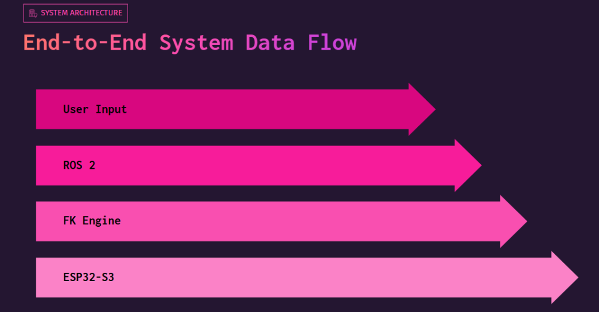
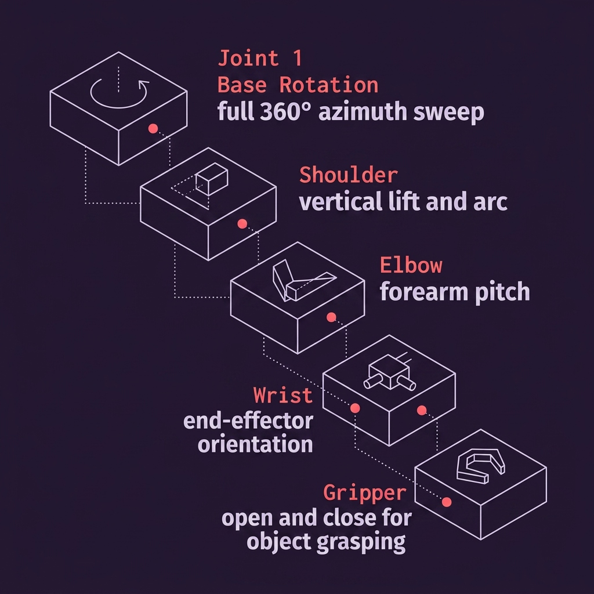
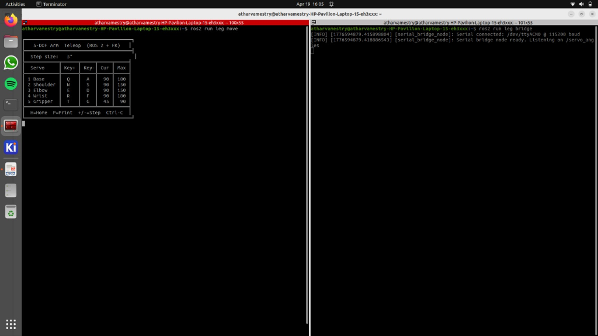

# 5-DOF Robotic Arm Controller

This project implements a complete control system for a 5-Degree of Freedom (5-DOF) robotic arm. It leverages a robust architecture consisting of user input, a ROS 2 framework for processing and forward kinematics (FK) calculations, and an ESP32-S3 microcontroller to interface directly with the physical servos.

## System Architecture

The end-to-end data flow operates sequentially to ensure low-latency control and smooth movements:
1. **User Input:** Key commands from the terminal.
2. **ROS 2:** Processes the commands via a leg bridge node.
3. **FK Engine:** Computes the forward kinematics.
4. **ESP32-S3:** Receives the processed angles over serial and commands the physical servos.

## Physical Model

The arm consists of 5 independent joints that mimic a human-like manipulator:
- **Base Rotation (Joint 1):** Full 360° azimuth sweep.
- **Shoulder:** Vertical lift and arc movement.
- **Elbow:** Forearm pitch control.
- **Wrist:** End-effector orientation.
- **Gripper:** Open and close functionality for grasping objects.

## Control Terminal

The system provides a Teleop terminal interface via ROS 2 to control the 5-DOF arm. You can step the joints incrementally and monitor the current angles of the Base, Shoulder, Elbow, Wrist, and Gripper in real-time.

